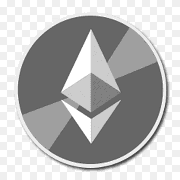

<!-- Improved compatibility of back to top link: See: https://github.com/othneildrew/Best-README-Template/pull/73 -->

<a name="readme-top"></a>

<!--
*** Thanks for checking out the Best-README-Template. If you have a suggestion
*** that would make this better, please fork the repo and create a pull request
*** or simply open an issue with the tag "enhancement".
*** Don't forget to give the project a star!
*** Thanks again! Now go create something AMAZING! :D
-->

<!-- PROJECT SHIELDS -->
<!--
*** I'm using markdown "reference style" links for readability.
*** Reference links are enclosed in brackets [ ] instead of parentheses ( ).
*** See the bottom of this document for the declaration of the reference variables
*** for contributors-url, forks-url, etc. This is an optional, concise syntax you may use.
*** https://www.markdownguide.org/basic-syntax/#reference-style-links
-->

<!-- PROJECT LOGO -->
<br />
<div align="center">
  <a href="https://github.com/github_username/repo_name">
    
  </a>

<h3 align="center">ERC-20 Contract</h3>

  <p align="center">
    Manual Token (MT), ERC-20 token with all functions implemented based on EIP-20 standard along with unit tests written in mocha.
    <br />
    <br />
    <a href="https://github.com/github_username/repo_name">View Demo</a>
    ·
    <a href="https://github.com/github_username/repo_name/issues">Report Bug</a>
    ·
    <a href="https://github.com/github_username/repo_name/issues">Request Feature</a>
  </p>
</div>

<!-- TABLE OF CONTENTS -->
<details>
  <summary>Table of Contents</summary>
  <ol>
    <li>
      <a href="#about-the-project">About The Project</a>
      <ul>
        <li><a href="#built-with">Built With</a></li>
      </ul>
    </li>
    <li>
      <a href="#getting-started">Getting Started</a>
      <ul>
        <li><a href="#prerequisites">Prerequisites</a></li>
        <li><a href="#installation">Installation</a></li>
      </ul>
    </li>
    <li><a href="#usage">Usage</a></li>
    <li><a href="#contributing">Contributing</a></li>
    <li><a href="#license">License</a></li>
    <li><a href="#contact">Contact</a></li>
  </ol>
</details>

<!-- ABOUT THE PROJECT -->

## About The Project

[![Product Name Screen Shot][product-screenshot]]()

Manual Token(MT), an ERC-20 contract developed using hardhat environment with properly written unit tests that have a coverage of more than **80%**. Mocha/Chai has been used to write tests. This involves a deploy script which can be easily used to deploy to different testsnes and mainnet with just a change in hardhat config file.

<p align="right">(<a href="#readme-top">back to top</a>)</p>

### Built With

- [![Solidity][solidity.sol]][solidity-url]
- [![React][react.js]][react-url]
- [![Bootstrap][bootstrap.com]][bootstrap-url]

<p align="right">(<a href="#readme-top">back to top</a>)</p>

<!-- GETTING STARTED -->

## Getting Started

Follow the below steps to get started with this project

### Prerequisites

This is an example of how to list things you need to use the software and how to install them.

- npm
  ```sh
  npm install npm@latest -g
  ```

### Installation

1. Clone the repo
   ```sh
   git clone https://github.com/github_username/repo_name.git
   ```
2. Install NPM packages
   ```sh
   npm install
   ```
3. Enter your API in `.env`
   ```env
    RINKEBY_RPC_URL='RINKEBY_RPC_URL'
    PRIVATE_KEY='YOUR PRIVATE KEY'
    ETHERSCAN_API_KEY='ETHER SCAN API KEY'
    COINMARKETCAP_API_KEY='COINMARKET API KEY'
   ```

<p align="right">(<a href="#readme-top">back to top</a>)</p>

<!-- USAGE EXAMPLES -->

## Usage

Run tests in hardhat environment

```sh
npm run hardhat test --network hardhat|rinkeby|localhost
```

Deploy the contract to testnet or mainnet

```sh
npm run hardhat deploy --network rinkeby|mainnet
```

<p align="right">(<a href="#readme-top">back to top</a>)</p>

<!-- CONTRIBUTING -->

## Contributing

Contributions are what make the open source community such an amazing place to learn, inspire, and create. Any contributions you make are **greatly appreciated**.

If you have a suggestion that would make this better, please fork the repo and create a pull request. You can also simply open an issue with the tag "enhancement".
Don't forget to give the project a star! Thanks again!

1. Fork the Project
2. Create your Feature Branch (`git checkout -b feature/AmazingFeature`)
3. Commit your Changes (`git commit -m 'Add some AmazingFeature'`)
4. Push to the Branch (`git push origin feature/AmazingFeature`)
5. Open a Pull Request

<p align="right">(<a href="#readme-top">back to top</a>)</p>

<!-- LICENSE -->

## License

Distributed under the MIT License. See `LICENSE.txt` for more information.

<p align="right">(<a href="#readme-top">back to top</a>)</p>

<!-- CONTACT -->

## Contact

Shariq Anwar - [@twitter_handle](https://twitter.com/twitter_handle) - shariqanwar59@gmail.com

Project Link: [https://github.com/shariqanwar20/ERC20](https://github.com/shariqanwar20/ERC20)

<p align="right">(<a href="#readme-top">back to top</a>)</p>

<!-- MARKDOWN LINKS & IMAGES -->
<!-- https://www.markdownguide.org/basic-syntax/#reference-style-links -->

[license-url]: https://github.com/shariqanwar20/ERC20/blob/master/LICENSE.txt
[linkedin-shield]: https://img.shields.io/badge/-LinkedIn-black.svg?style=for-the-badge&logo=linkedin&colorB=555
[linkedin-url]: https://linkedin.com/in/shariqanwar20
[product-screenshot]: images/AboutTheProject.png
[solidity.sol]: https://img.shields.io/badge/-Solidity-363636?logo=solidity&style=for-the-badge
[solidity-url]: https://docs.soliditylang.org/en/v0.8.17/
[react.js]: https://img.shields.io/badge/React-20232A?style=for-the-badge&logo=react&logoColor=61DAFB
[react-url]: https://reactjs.org/
[bootstrap.com]: https://img.shields.io/badge/Bootstrap-563D7C?style=for-the-badge&logo=bootstrap&logoColor=white
[bootstrap-url]: https://getbootstrap.com
